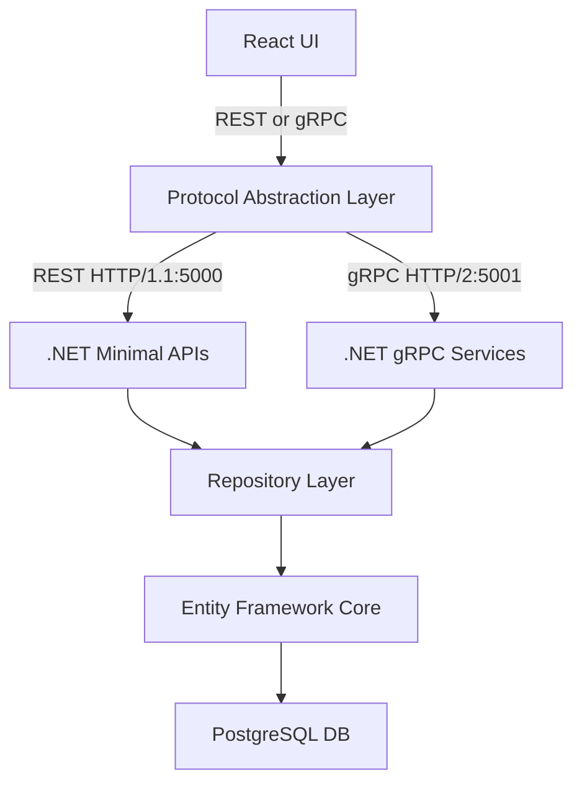
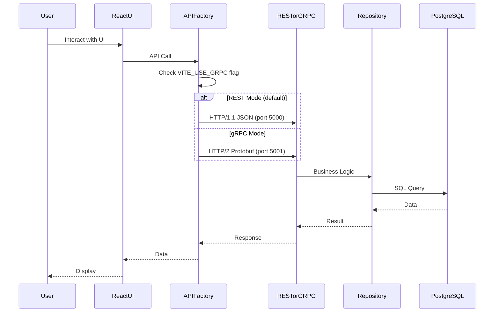

# CashCaddy

A simple expense tracker with dual protocol support (REST + gRPC) written in React-TS and .NET 9 with PostgreSQL.

## Features

- ✅ Full CRUD operations for expense management
- ✅ Dual protocol support: REST (JSON) and gRPC (Protocol Buffers)
- ✅ Feature flag for runtime protocol switching
- ✅ React 19 + TypeScript frontend
- ✅ .NET 9 Web API backend with minimal APIs and gRPC services
- ✅ PostgreSQL database with Entity Framework Core
- ✅ Docker Compose for containerized deployment

## Architecture



## Communication Flow



## Getting Started

### Prerequisites
- Docker & Docker Compose
- Node.js 18+ (for local frontend development)
- .NET 9 SDK (for local backend development)

### Quick Start with Docker

```bash
# Start all services
docker compose up

# Frontend: http://localhost:5173
# REST API: http://localhost:5000
# gRPC API: http://localhost:5001
```

### Local Development

#### Backend
```bash
cd backend/src/CashCaddy
dotnet run
# Serves REST on port 5000, gRPC on port 5001
```

#### Frontend
```bash
cd frontend/cash-caddy-ui
npm install
npm run dev
# Serves on port 5173
```

#### Database
```bash
docker compose up postgres
# PostgreSQL on port 5432
```

## Protocol Switching

The application supports runtime protocol switching via environment variable:

### Use REST (Default)
```bash
# frontend/cash-caddy-ui/.env
VITE_USE_GRPC=false
```

### Use gRPC
```bash
# frontend/cash-caddy-ui/.env
VITE_USE_GRPC=true
```

**Note:** Restart the frontend dev server after changing the environment variable.

## API Reference

### REST Endpoints (Port 5000)
| Method | Endpoint | Description |
|--------|----------|-------------|
| GET | `/expenses` | Get all expenses |
| GET | `/expenses/{id}` | Get expense by ID |
| POST | `/expenses` | Create new expense |
| PUT | `/expenses/{id}` | Update expense |
| DELETE | `/expenses/{id}` | Delete expense |

### gRPC Service (Port 5001)
| RPC Method | Description |
|------------|-------------|
| `GetExpenses()` | Get all expenses |
| `GetExpense(id)` | Get expense by ID |
| `CreateExpense(expense)` | Create new expense |
| `UpdateExpense(expense)` | Update expense |
| `DeleteExpense(id)` | Delete expense |

**Proto file:** `backend/src/CashCaddy/Protos/expense.proto`

## Tech Stack

### Frontend
- React 19 with TypeScript
- Vite build tool
- Axios (REST client)
- gRPC-Web (gRPC client)
- Protocol abstraction layer for transparent switching

### Backend
- .NET 9 Web API
- Minimal APIs (REST endpoints)
- gRPC with gRPC-Web support
- Entity Framework Core
- Repository pattern
- Protocol Buffers code generation

### Database
- PostgreSQL 16
- Entity Framework migrations
- Automatic seeding with sample data

### DevOps
- Docker & Docker Compose
- Multi-stage builds
- Volume persistence for database

## Project Structure

```
/backend/src/CashCaddy/
  ├── Models/              # Entity models
  ├── Data/                # DbContext
  ├── repositories/        # Repository pattern
  ├── Protos/              # Protocol Buffer definitions
  ├── Services/            # gRPC service implementations
  ├── Migrations/          # EF Core migrations
  └── Program.cs           # App configuration

/frontend/cash-caddy-ui/
  ├── src/
  │   ├── components/      # React components
  │   ├── services/        # API layer (REST, gRPC, factory)
  │   ├── protos/          # Proto files (copied from backend)
  │   └── generated/       # Generated gRPC client code
  └── .env                 # Environment configuration
```

## Development Commands

### Frontend
```bash
npm run dev          # Development server
npm run build        # Production build
npm run lint         # ESLint check
npm run test         # Run unit tests
```

### Protocol Buffer Code Generation

#### Backend (Automatic)
The backend automatically generates C# code from proto files during build:
```bash
cd backend/src/CashCaddy
dotnet build  # Generates C# classes from expense.proto
```

#### Frontend (Manual when proto changes)
```bash
cd frontend/cash-caddy-ui
# Install dependencies first
npm install ts-proto @bufbuild/protobuf

# Generate TypeScript code from proto
protoc --plugin=./node_modules/.bin/protoc-gen-ts_proto \
  --ts_proto_out=src/generated \
  --ts_proto_opt=env=browser,outputServices=generic-definitions,esModuleInterop=true \
  -I=src/protos expense.proto
```

**Note:** Generated files are committed to git for CI/CD compatibility.

### Backend
```bash
dotnet run           # Run application
dotnet build         # Build and generate proto files
dotnet test          # Run tests
```

## Contributing

See `agent-os/` directory for agent-os workflow system documentation and specs.

## License

MIT