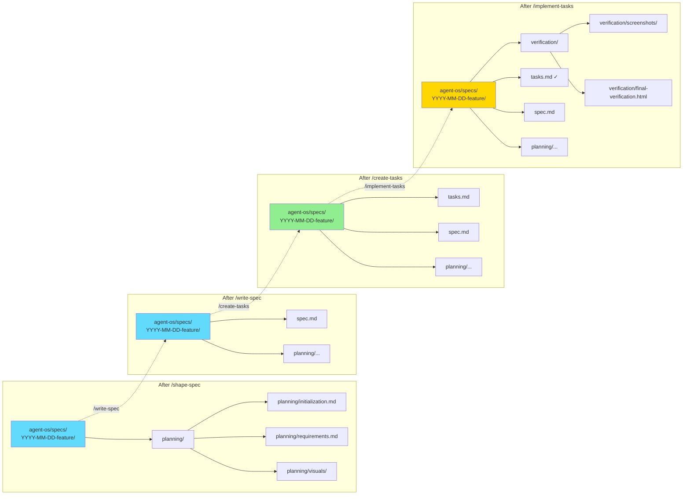
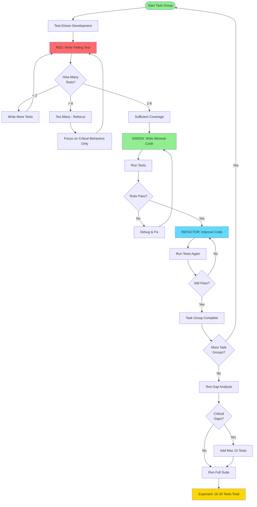
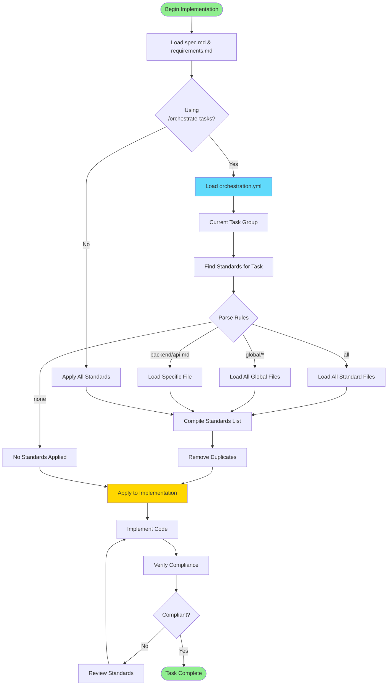
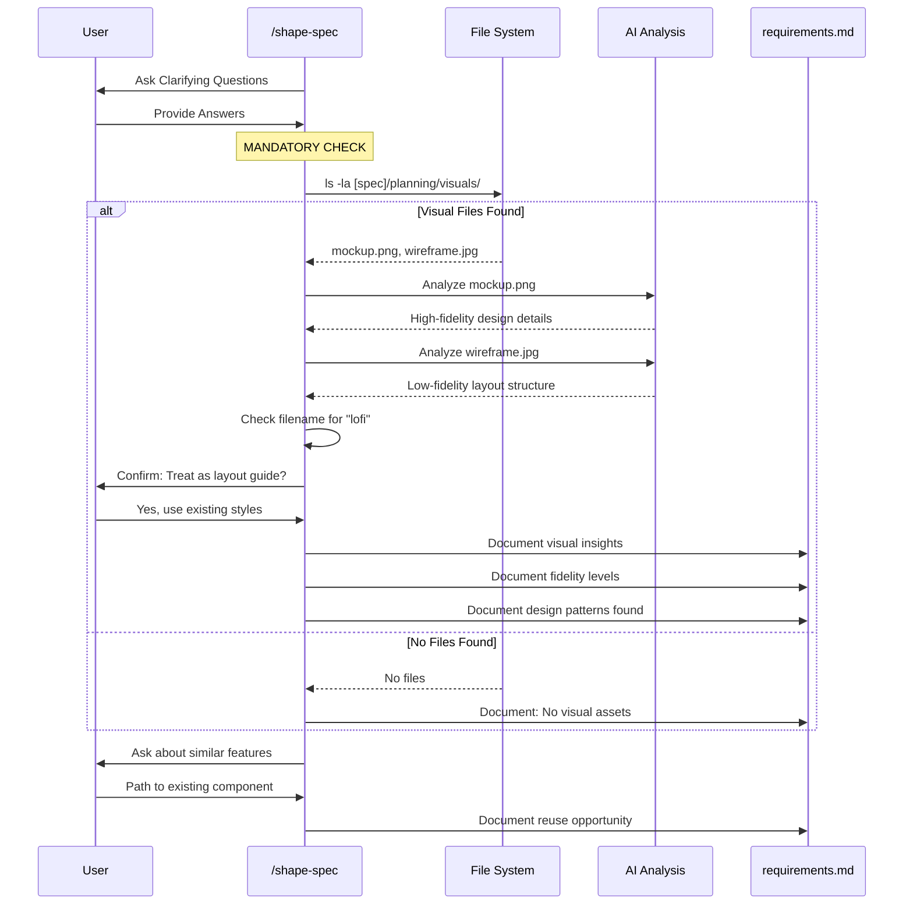

# Agent-OS Development Flow

This document illustrates the agent-os workflow system for planning and implementing features.

## Complete Feature Development Workflow

```mermaid
flowchart TD
    Start([New Feature Idea]) --> HasProduct{Product<br/>Documented?}
    
    HasProduct -->|No| PlanProduct[/plan-product]
    HasProduct -->|Yes| ShapeSpec[/shape-spec]
    
    PlanProduct --> Mission[Create mission.md]
    Mission --> Roadmap[Create roadmap.md]
    Roadmap --> TechStack[Create tech-stack.md]
    TechStack --> ShapeSpec
    
    ShapeSpec --> Initialize[Initialize Spec Folder]
    Initialize --> Questions[Ask Clarifying Questions]
    Questions --> VisualCheck{Visual Assets<br/>Provided?}
    VisualCheck -->|Yes| AnalyzeVisuals[Analyze Mockups/Wireframes]
    VisualCheck -->|No| CodeReuse
    AnalyzeVisuals --> CodeReuse{Similar Code<br/>Exists?}
    CodeReuse -->|Yes| DocumentReuse[Document Reuse Opportunities]
    CodeReuse -->|No| SaveRequirements
    DocumentReuse --> SaveRequirements[Save requirements.md]
    
    SaveRequirements --> WriteSpec[/write-spec]
    WriteSpec --> SearchCode[Search for Reusable Code]
    SearchCode --> CreateSpec[Create spec.md]
    CreateSpec --> SpecReview{Spec<br/>Approved?}
    
    SpecReview -->|No| ShapeSpec
    SpecReview -->|Yes| CreateTasks[/create-tasks]
    
    CreateTasks --> BreakDown[Break into Task Groups]
    BreakDown --> Dependencies[Identify Dependencies]
    Dependencies --> Estimates[Add Effort Estimates]
    Estimates --> SaveTasks[Save tasks.md]
    
    SaveTasks --> ImplChoice{Implementation<br/>Approach?}
    
    ImplChoice -->|Simple| ImplementTasks[/implement-tasks]
    ImplChoice -->|Advanced| OrchestrateTasks[/orchestrate-tasks]
    
    OrchestrateTasks --> CreateOrch[Create orchestration.yml]
    CreateOrch --> AssignStandards[Assign Standards per Task]
    AssignStandards --> GenPrompts[Generate Prompt Files]
    GenPrompts --> ExecutePrompts[Execute Task Prompts]
    
    ImplementTasks --> DetermineTask[Determine Task Group]
    ExecutePrompts --> Implement
    DetermineTask --> Implement[Implement Task Group]
    
    Implement --> FollowPatterns[Follow Existing Patterns]
    FollowPatterns --> WriteTests[Write 2-8 Focused Tests]
    WriteTests --> WriteCode[Implement Code]
    WriteCode --> RunTests[Run Task Tests]
    RunTests --> UITask{UI Task?}
    
    UITask -->|Yes| BrowserTest[Test in Browser]
    UITask -->|No| UpdateTasks
    BrowserTest --> Screenshot[Save Screenshots]
    Screenshot --> UpdateTasks[Mark Tasks Complete]
    
    UpdateTasks --> MoreTasks{More Tasks?}
    MoreTasks -->|Yes| DetermineTask
    MoreTasks -->|No| Verify[/verify-implementation]
    
    Verify --> CheckComplete[Verify All Tasks Complete]
    CheckComplete --> UpdateRoadmap[Update roadmap.md]
    UpdateRoadmap --> RunAllTests[Run Full Test Suite]
    RunAllTests --> CreateReport[Create Verification Report]
    CreateReport --> End([Feature Complete])
    
    style Start fill:#90ee90
    style PlanProduct fill:#61dafb
    style ShapeSpec fill:#61dafb
    style WriteSpec fill:#61dafb
    style CreateTasks fill:#61dafb
    style ImplementTasks fill:#ffd700
    style OrchestrateTasks fill:#ffd700
    style End fill:#90ee90
```

## Agent-OS Command Structure

```mermaid
graph TB
    subgraph "Planning Commands"
        PP[/plan-product]
        PP1[1-product-concept.md]
        PP2[2-create-mission.md]
        PP3[3-create-roadmap.md]
        PP4[4-create-tech-stack.md]
        PP --> PP1 --> PP2 --> PP3 --> PP4
    end
    
    subgraph "Specification Commands"
        SS[/shape-spec]
        SS1[1-initialize-spec.md]
        SS2[2-shape-spec.md]
        SS --> SS1 --> SS2
        
        WS[/write-spec]
        WS1[write-spec.md]
        WS --> WS1
    end
    
    subgraph "Implementation Commands"
        CT[/create-tasks]
        CT1[1-get-spec-requirements.md]
        CT2[2-create-tasks-list.md]
        CT --> CT1 --> CT2
        
        IT[/implement-tasks]
        IT1[1-determine-tasks.md]
        IT2[2-implement-tasks.md]
        IT3[3-verify-implementation.md]
        IT --> IT1 --> IT2 --> IT3
        
        OT[/orchestrate-tasks]
        OT1[orchestrate-tasks.md]
        OT --> OT1
    end
    
    PP4 -.->|Next| SS
    SS2 -.->|Next| WS
    WS1 -.->|Next| CT
    CT2 -.->|Next| IT
    CT2 -.->|Or| OT
    
    style PP fill:#61dafb
    style SS fill:#61dafb
    style WS fill:#61dafb
    style CT fill:#90ee90
    style IT fill:#ffd700
    style OT fill:#ffd700
```

## Spec Folder Structure Evolution



## Testing Strategy Flow



## Standards Application Flow



## Visual Asset Processing Flow



## Orchestration vs Simple Implementation

```mermaid
graph TB
    Start([Tasks Ready]) --> Choice{Choose<br/>Approach}
    
    Choice -->|Simple| Simple[/implement-tasks]
    Choice -->|Advanced| Advanced[/orchestrate-tasks]
    
    subgraph "Simple Path"
        Simple --> S1[Determine Task Group]
        S1 --> S2[Load All Standards]
        S2 --> S3[Implement]
        S3 --> S4[Mark Complete]
        S4 --> S5{More?}
        S5 -->|Yes| S1
        S5 -->|No| SV[Verify All]
    end
    
    subgraph "Advanced Path"
        Advanced --> A1[Create orchestration.yml]
        A1 --> A2[List All Task Groups]
        A2 --> A3[Ask User: Standards per Task]
        A3 --> A4[Generate Prompt Files]
        A4 --> A5[Each Prompt Has Custom Standards]
        A5 --> A6[Execute Prompts in Order]
        A6 --> A7{More?}
        A7 -->|Yes| A6
        A7 -->|No| AV[Verify All]
    end
    
    SV --> End([Complete])
    AV --> End
    
    style Simple fill:#90ee90
    style Advanced fill:#ffd700
    style End fill:#90ee90
```
