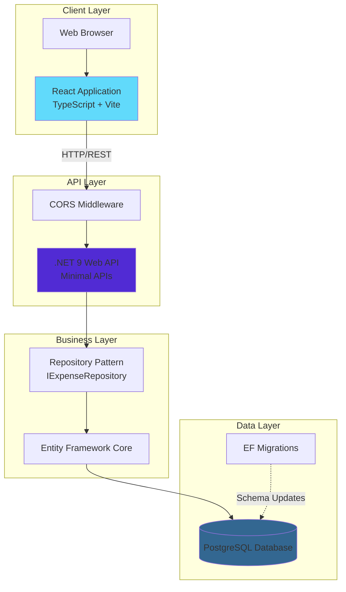
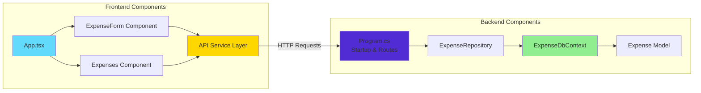
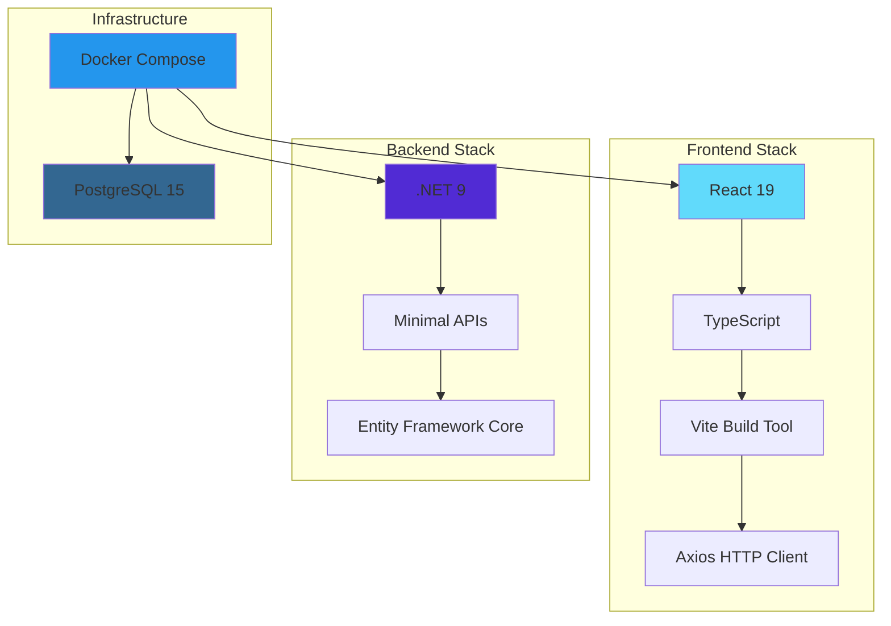
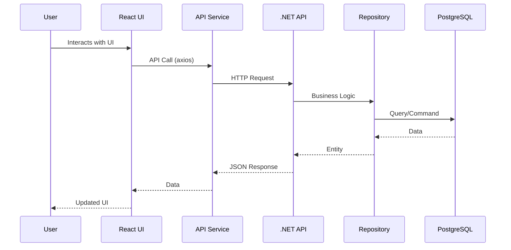
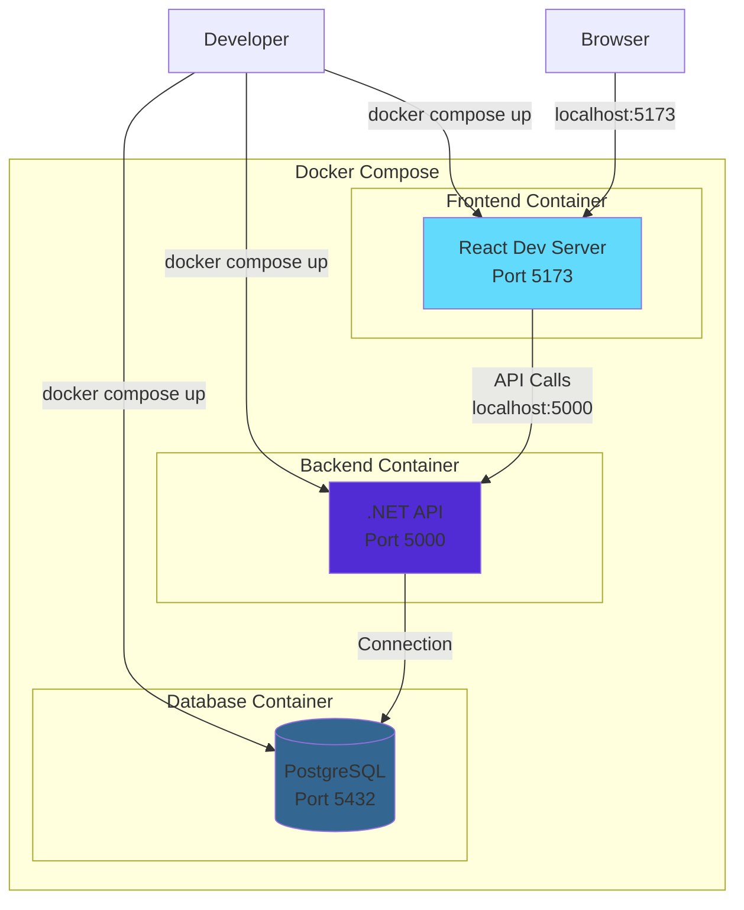

# System Architecture

This document provides an overview of the Cash Caddy expense tracker system architecture.

## High-Level Architecture



## Component Architecture



## Technology Stack



## Data Flow Architecture



## Deployment Architecture



## Directory Structure

```mermaid
graph TD
    Root[/]
    
    Root --> Frontend[frontend/cash-caddy-ui/]
    Root --> Backend[backend/]
    Root --> Docker[docker-compose.yml]
    Root --> AgentOS[agent-os/]
    
    Frontend --> FESrc[src/]
    FESrc --> Components[components/]
    FESrc --> Services[services/]
    
    Backend --> BESrc[src/CashCaddy/]
    Backend --> Tests[tests/]
    
    BESrc --> Models[Models/]
    BESrc --> Repos[repositories/]
    BESrc --> Data[Data/]
    BESrc --> Migrations[Migrations/]
    
    AgentOS --> Commands[commands/]
    AgentOS --> Standards[standards/]
    AgentOS --> Specs[specs/]
    
    style Frontend fill:#61dafb
    style Backend fill:#512bd4
    style AgentOS fill:#ffd700
```
