# gRPC Architecture and Data Flow

## Overview
This document visualizes the REST to gRPC migration architecture, showing dual protocol support and communication patterns.

## High-Level Architecture

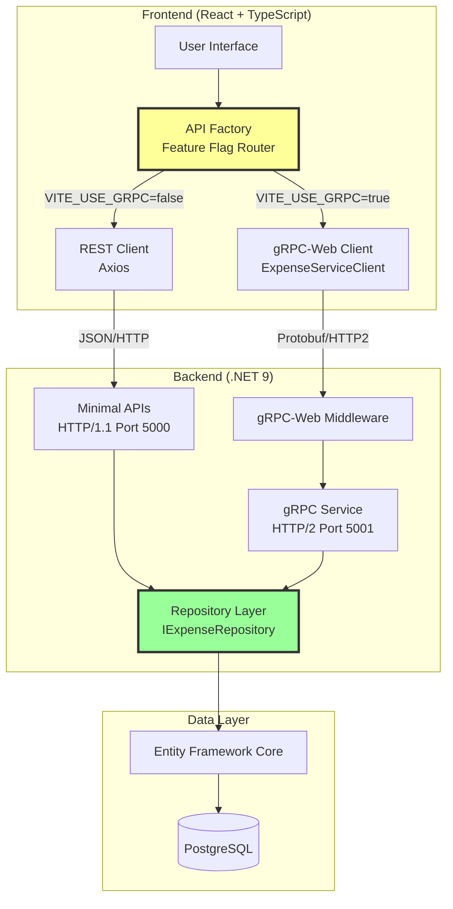

## Protocol Switching Flow

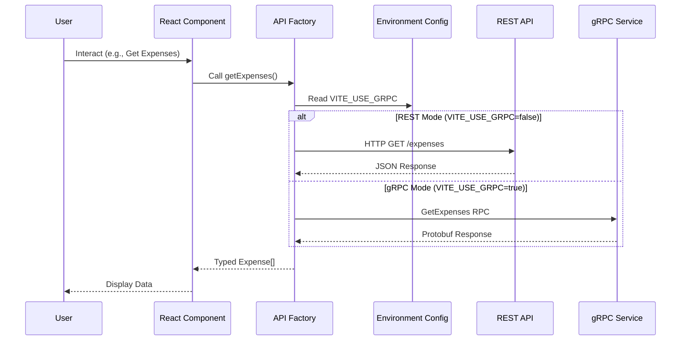

## REST Communication Flow

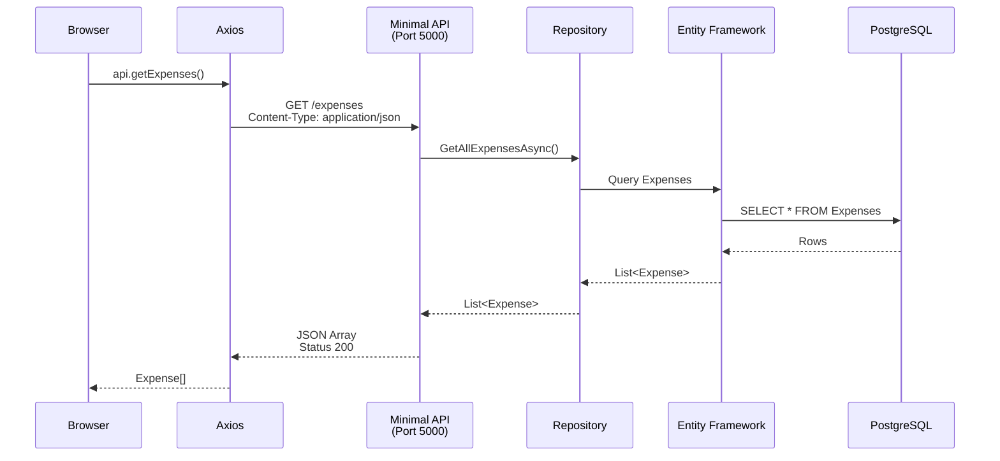

## gRPC Communication Flow

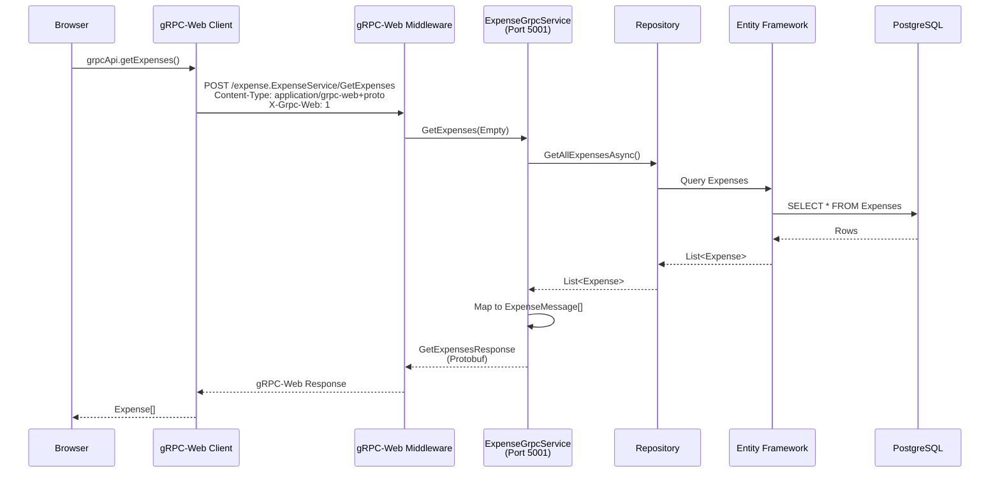

## Dual Protocol Comparison

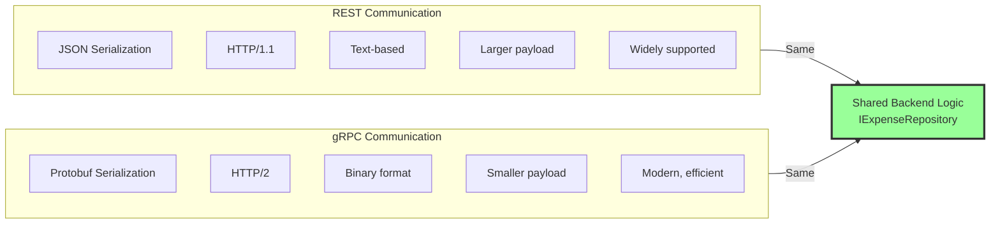

## Port Configuration

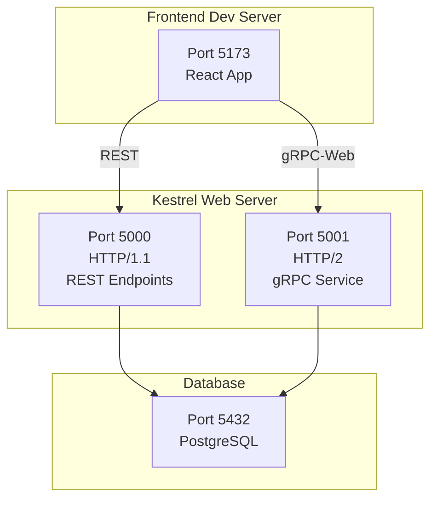

## Feature Flag Decision Tree

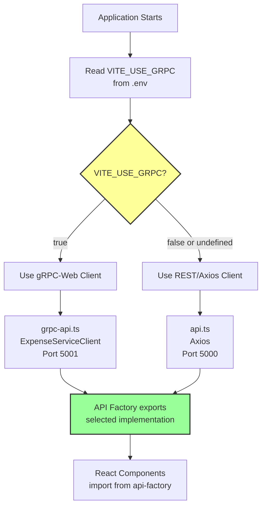

## Data Transformation Pipeline

### REST Pipeline
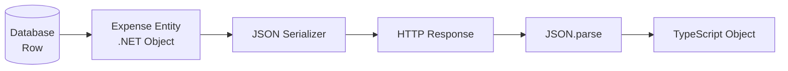

### gRPC Pipeline
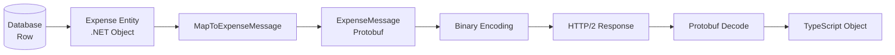

## Error Handling Flow

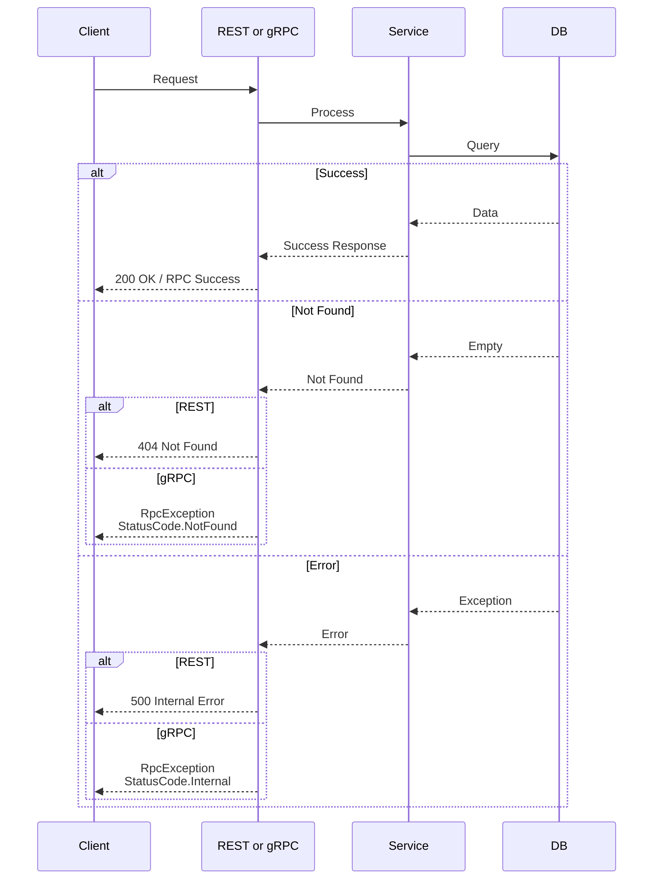

## Deployment Architecture

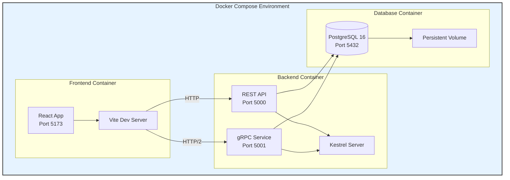

## Key Design Decisions

### 1. Shared Repository Layer
Both REST and gRPC implementations use the same `IExpenseRepository` interface, ensuring:
- Single source of truth for business logic
- Consistent data access patterns
- Easy maintenance and testing

### 2. Protocol Abstraction
The `api-factory.ts` provides transparent protocol switching:
- Components remain protocol-agnostic
- No code changes required to switch protocols
- Runtime configuration via environment variable

### 3. Dual Port Configuration
Separate ports for each protocol:
- **Port 5000**: HTTP/1.1 for REST (widely compatible)
- **Port 5001**: HTTP/2 for gRPC (modern, efficient)

### 4. gRPC-Web Middleware
Enables browser-based gRPC communication:
- Translates gRPC-Web to native gRPC
- CORS configuration for cross-origin requests
- Header exposure for status codes

### 5. Type Safety
TypeScript interfaces ensure type consistency:
- Shared `Expense` interface across both protocols
- Compile-time type checking
- IDE autocomplete support
