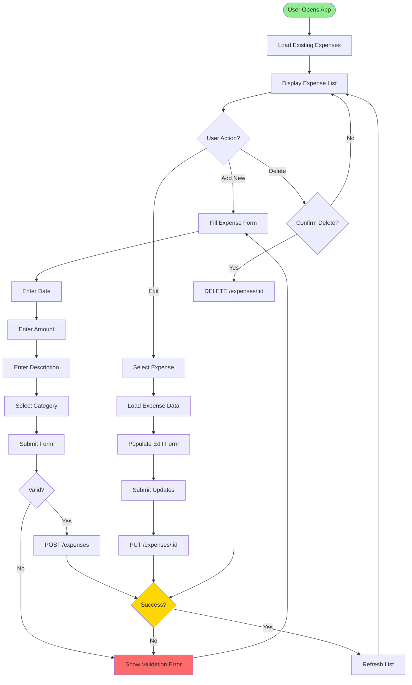
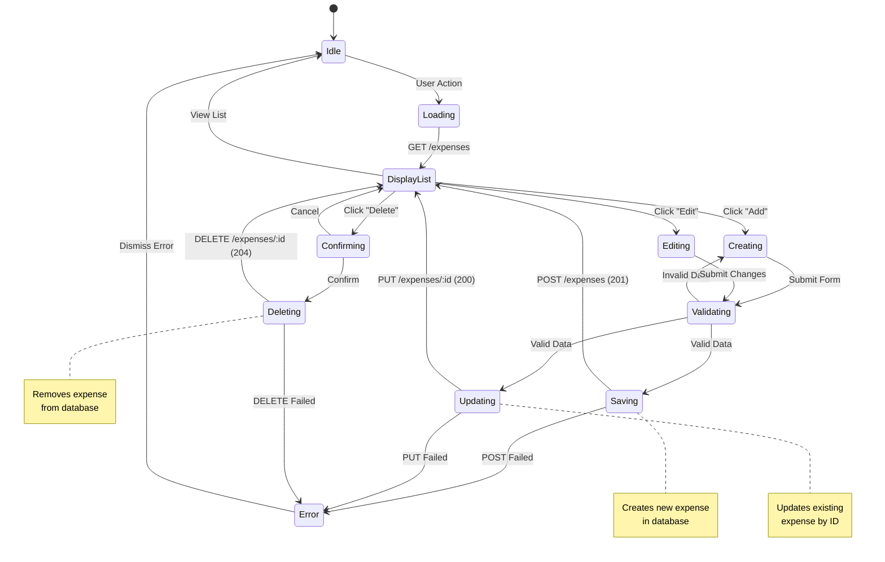
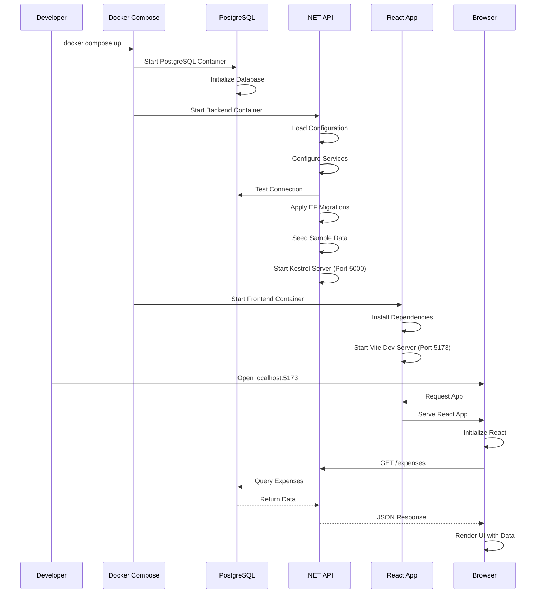
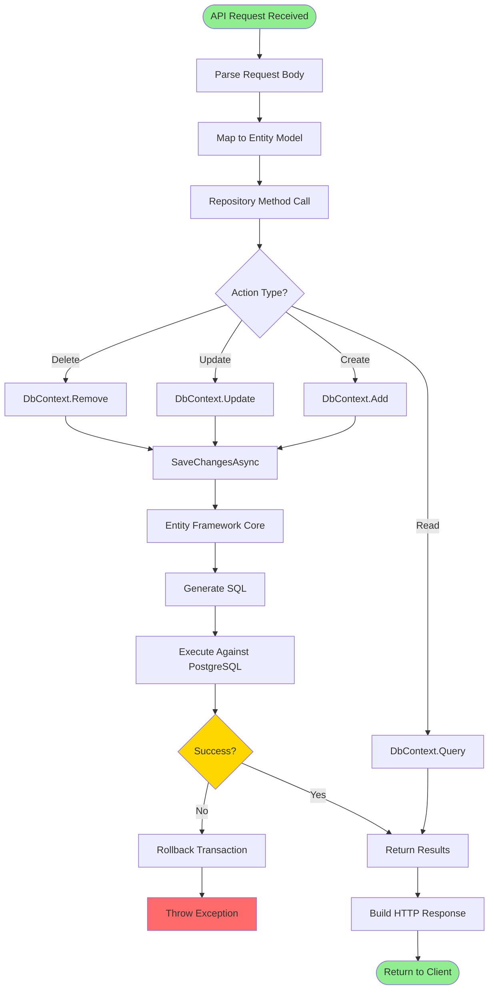
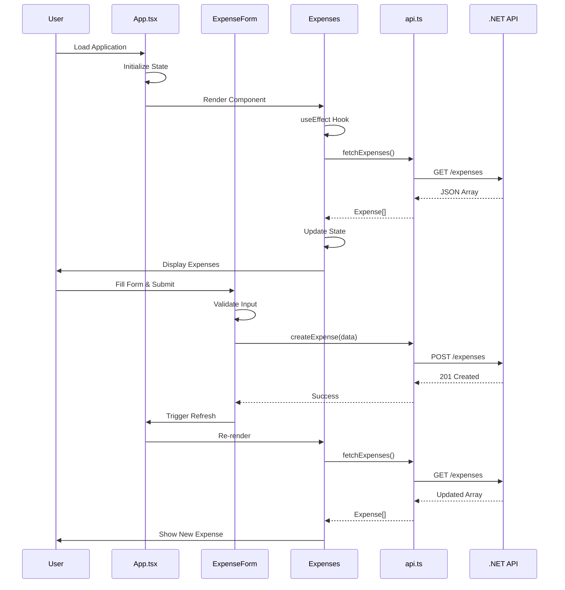
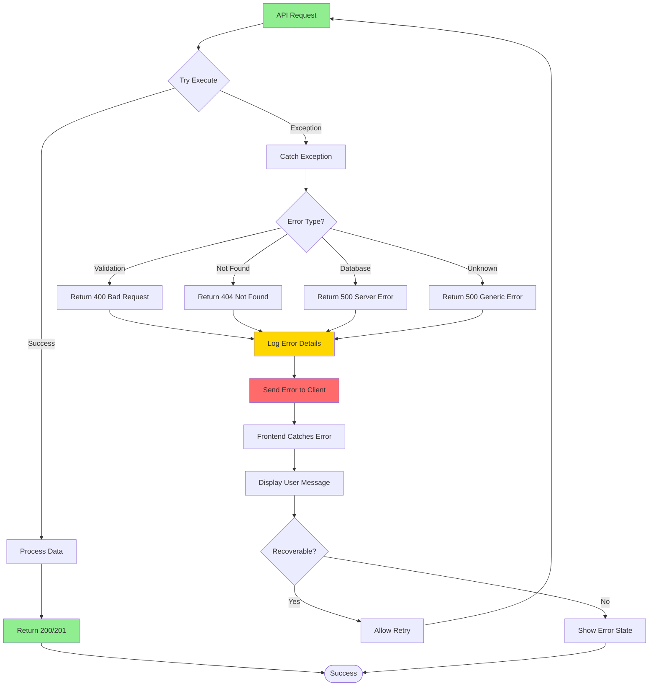

# Application Workflows

This document illustrates the key workflows and processes in the Cash Caddy expense tracker application.

## User Workflow: Create Expense

## API Request Flow

```mermaid
flowchart LR
    subgraph "Frontend"
        UI[React Component]
        API[API Service<br/>api.ts]
    end
    
    subgraph "Network"
        HTTP[HTTP Request<br/>Axios]
        CORS[CORS Check]
    end
    
    subgraph "Backend"
        Route[Minimal API Route]
        Repo[Repository]
        EF[Entity Framework]
        DB[(Database)]
    end
    
    UI -->|User Action| API
    API -->|axios.get/post/put/delete| HTTP
    HTTP --> CORS
    CORS -->|Allowed Origin| Route
    Route -->|Call Method| Repo
    Repo -->|Query/Command| EF
    EF -->|SQL| DB
    
    DB -.->|Data| EF
    EF -.->|Entity| Repo
    Repo -.->|DTO| Route
    Route -.->|JSON| CORS
    CORS -.->|Response| HTTP
    HTTP -.->|Promise| API
    API -.->|Update State| UI
    
    style UI fill:#61dafb
    style Route fill:#512bd4
    style DB fill:#336791
```

## CRUD Operations Flow

## Application Startup Flow

## Data Persistence Flow

## Component Lifecycle Flow

## Error Handling Flow

